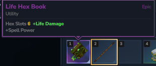
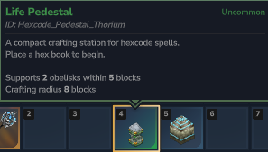
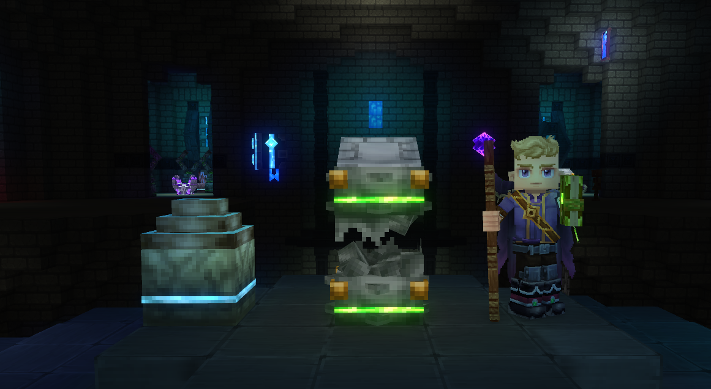
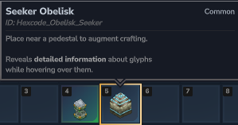

# Advanced Magic

The staff is a great teacher, but a poor librarian. Whatever you draw with the Crude Hex Staff lives only as long as you keep redrawing it. To save a real **Hex** - multiple glyphs, linked together, ready to pull out when you need them - you need three new things: a **Hexbook**, a **Pedestal**, and at optinally some **Obelisks**. All three are crafted at the **Arcane Bench**.

## Gear up: the Arcane Bench

Open the Arcane Bench and look under **Arcane → Hexcode**. Every Hexcode item lives in this category - staffs, books, pedestals, obelisks, essences.

> **Terminology:** A Hexbook is your spell library. It holds 6-12 finished Hexes and travels with you when you cast. You can hold as many hexbooks as you want

Hexbooks come in five elemental variants - **Life, Fire, Ice, Arcane, and Void**. The element is mostly cosmetic (color, particles, flavor) with small stat differences. Pick whichever fits the loadout you're building. We'll use **Life** as the running example.

You'll also need a **Pedestal**. Pedestals come in their own set of variants - **Arcane, Fire, Thorium, and Void** - and each one carries different limits on how many obelisks it accepts and how far it scans for them. Craft whichever one matches your playstyle; the book and the pedestal don't need to share an element.

## Setting up your station

Place the Pedestal somewhere with room to walk a full circle around it. This is your workbench - it reads your book, holds your essence, and projects glyphs into the air for you to shape.

> **Terminology:** An Obelisk is a passive amplifier. It does nothing on its own - it sits near a Pedestal and lends its **Power** and **Handler** to whatever you craft there.

Each Obelisk contributes a different handler. A **Life** obelisk feeds **accuracy**, a **Seeker** obelisk feeds information about what you're looking at, and so on. Higher Power means a stronger contribution.

The Pedestal scans nearby blocks within its range and registers obelisks up to its limit - the exact numbers depend on which Pedestal you crafted, so a Void Pedestal will accept far more obelisks than a Life one. Stand them up around the workbench and the Pedestal will pick up everything in reach.

> **NOTE:** Pedestals are global, not per-player. If a friend places their book down first, you'll see their session - wait your turn, or build somewhere private.

## Entering Crafting Mode

The Pedestal walks through four states: **Idle → Ready → Selecting → Crafting**. Knowing them helps you read what the station is doing.

Walk up to your Pedestal and drop your Hexbook on top. The book sits on top of the stone and the Pedestal goes from Idle to **Ready**.

Clicking it again will bring the pedestal from **Ready** to **Selecting** mode - glyphs you have access to will appear around the pedestal ready for you to select which one to edit.
> **NOTE:** Your hexbook determines how many slots are visible. The "slots" when empty appear as grey circles. As you fill out your slots, you will see your hexes replace these spheres.

<video autoplay loop muted playsinline src="../Images/entering-selection.mp4"></video>

To enter **Crafting Mode**, hold your hexstaff and click on one of the slots available. It doesn't matter which one you choose for now. You know you did it correctly when an Orange Sphere appears above the Pedestal,

<video autoplay loop muted playsinline src="../Images/entering-crafting.mp4"></video>
> **NOTE:** The orange sphere is your **Entrypoint** to your hex. It is what starts the execution chain

## Drawing your first two glyphs

Drawing here works the same as on the staff. Hold **Secondary (RMB)** to begin your **Drawing Phase**. Then, click and drag using **Primary (LMB)** to create your shape. Take as much time as you need when getting started. It will only check your shape once you release **Secondary (RMB)**.
> **NOTE:** Accuracy and Speed are both factors into the total quality of your glyphs. They will change color from Purple (okay) -> Light Blue (legendary) depending on how good these stats are. Accuracy determines how much **Volatility** the glyph costs while Speed determines how much **Mana** the glyph costs.

We're building a **Projectile → Force** chain: a projectile that, on hit, applies force in the target's look direction.

Start with drawing **Force** - the single circle `◯`, pure Energy. Force pushes whatever the target is along the target's look direction.

<video autoplay loop muted playsinline src="../Images/draw-force.mp4"></video>

Then draw the **Projectile** glyph - the two-shape combo `◯△`, Energy over Time. It's your launcher: anything chained after it triggers when the projectile hits something.

<video autoplay loop muted playsinline src="../Images/draw-projectile.mp4"></video>
> **NOTE:** By default, **Projectile** writes what it hit to the "default variable" - think of this as your current target. When ****Force** follows **Projectile**, it applies force to whatever the current "default variable" is - and in this case, that is the thing hit by **Projectile**

Two glyphs floating, unlinked. Right now they don't know about each other.

## Linking via the Next slot

This is the new mechanic. In Getting-Started you nested one shape inside another. Here, you wire glyphs together by their slots.

First, specify **Projectile** as the first glyph. Drag the **Entrypoint** to the **Projectile** glyph

Then, click the **Projectile** glyph to expose its slots. Find the **Next** slot, drag it onto the **Force** glyph, and release. The two glyphs are now chained - Projectile fires first, and on collision its Next slot triggers Force on whatever it hit.

> **Terminology:** A Slot is an input or output on a glyph - a target, a magnitude, a direction. One special slot, **Next**, is the output that wires one glyph into another.

<video autoplay loop muted playsinline src="../Images/link-glyphs.mp4"></video>

> **NOTE:** Higher-tier glyphs cost more volatility, and a linked chain pays the cost for every glyph it contains. If your staff's volatility budget can't cover the chain, the spell will misfire when you cast it. Check the [Glyph Index](../Codec/Glyph-Index.md) for tier costs.

## Saving to the Hexbook

Once your Hex is wired, it auto-saves to the book sitting on the Pedestal. Pick the book back up - your new Hex travels with you. A book holds up to it's max amount of hexes; come back to the Pedestal any time to add, edit, or rewire.

## Casting

Casting from a book is almost the same motion as casting from the staff alone, with one swap: the book is your library now.

Put the **Hexstaff in your mainhand** and the **Hexbook in your offhand**. Without both, casting from the book won't trigger.

Hold **Secondary (RMB)**. Your saved Hexes orbit you, the same way Casting Mode worked with the staff - except the options are pulled from the book instead of being drawn on the fly. Hover the Projectile-Force Hex and release Secondary to set it as your **Active Hex**.

Press **Primary (LMB)** to cast. The projectile launches, hits, and Force fires through the Next link - the target gets shoved in the direction they're looking.

<video autoplay loop muted playsinline src="../Images/executing-glyph.mp4"></video>

> **NOTE:** Decay still applies. Every cast wears the Hex down a little. Re-select the hex to refresh it!

## Where to go next

You now have the full loop: craft, station, draw, link, save, cast. Every other Hex you ever build is some variation of these same six steps with different glyphs.

For the full glyph catalog - tiers, slots, shape combinations, and what each one actually does - head to the [Glyph Index](../Codec/Glyph-Index.md).
